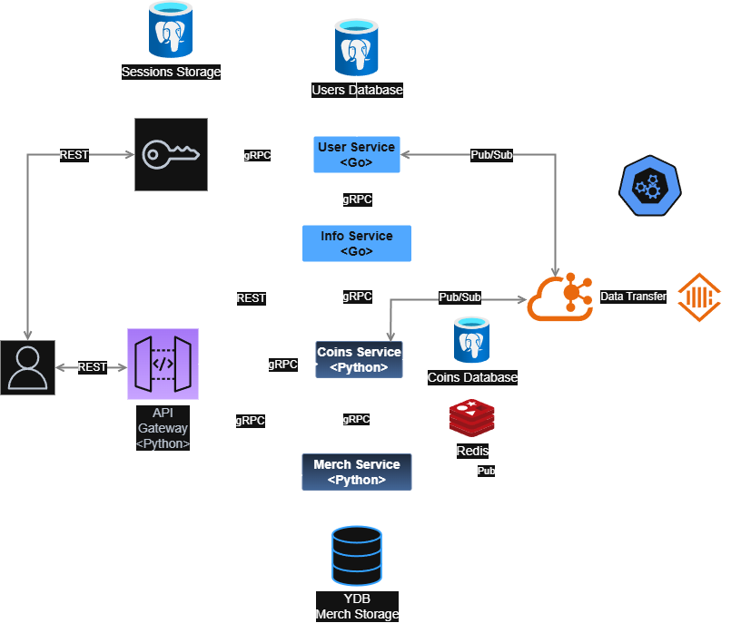

# AvitoTech-Internship-BackendTrainee-Assignment-Winter-2025

## Архитектура

### Сервисы

- [**API Gateway**](./services/api-gateway) - *REST* микросервис на *Python*, авторизует запросы и конвертирует *JSON<->Protobuf*.
- [**Auth Service**](./services/aith-service) - *REST* микросервис на *Python*, аутентифицирует пользователей, отправляет запросы **User Service**.
- [**User Service**](./services/user-service) - *gRPC* микросервис на *Go*, хранит данные о пользователях и их инвентарях, публикует сообщения о создании пользователей и слушает сообщения о покупках.
- [**Info Service**](./services/info-service) - *REST* микросервис на *Go*, агрегирует данные (информация о пользователях и инвентаре от **User Service** и баланс с транзакциями от **Coins Service**).
- [**Coins Service**](./services/coins-service) - *gRPC* микросервис на *Python*, хранит данные о средствах пользователей и работает с транзакциями, слушает сообщения о создании пользователей для создания аккаунта с балансом и публикует сообщения о транзакциях. Хранит балансы в формате целая и дробная части. Все финансовые операции проводятся в транзакциях с уровнем изоляции *REPEATBLE READ* и блокировской *FOR UPDATE*, а также сортировкой для исключения взаимных блокировок.
- [**Merch Service**](./services/merch-service) - *gRPC* микросервис на *Python*, хранит данные о товарах и отправляет запросы на покупки, публикует сообщения о покупках.

### Инфраструктура

- **PostgreSQL** - SQL база данных.
- **Yandex Database (YDB)** - NewSQL база данных.
- **Redis** - проверка идемпотентности.
- **Zookeeper** - оркестрация кластера брокеров сообщений.
- **Kafka** - брокер сообщений.
- **ClickHouse** - хранение истории транзакций.

### Деплой

[Kubernetes + Helm](./deployments/k8s/)

### Тесты

Каждый микросервис имеет unit и интеграционные тесты.
В папке [tests](./tests/) есть [end-to-end](./tests/e2e/README.md) тесты и [нагрузочное тестирование](./tests/load-tests/README.md) с помощью Яндекс Танка.

### CI/CD
Настроен [ci/cd](./.github/workflows/) для GitHub.
